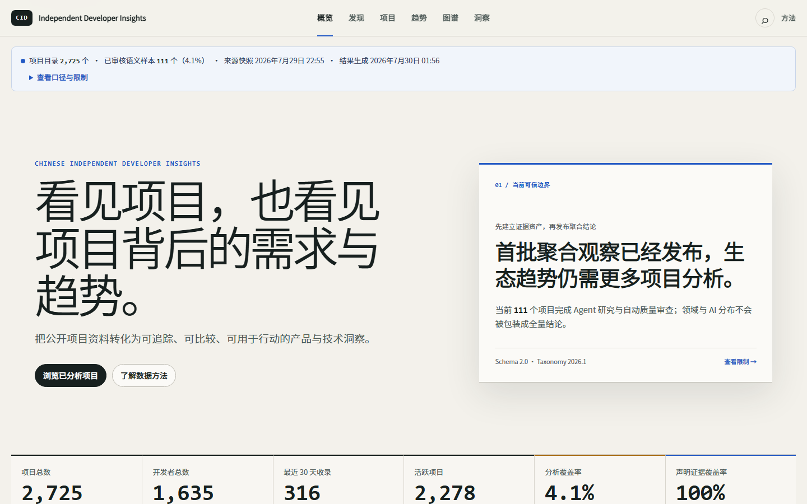
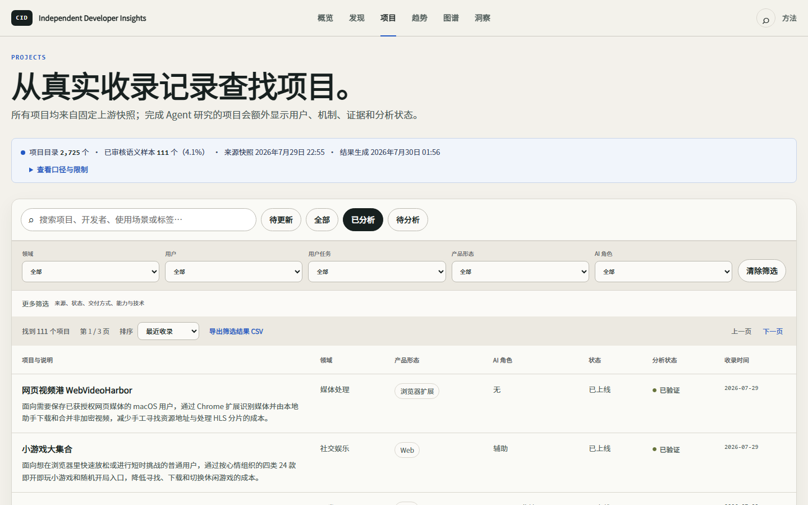
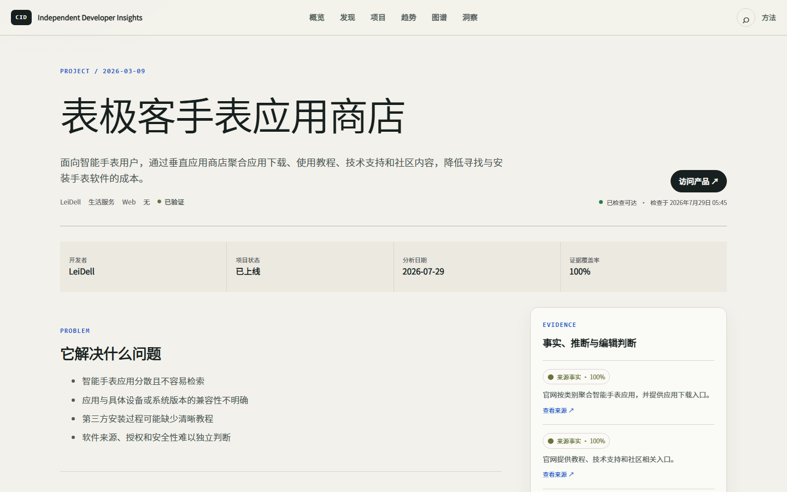

# Chinese Independent Developer Insights

**看见项目，也看见项目背后的需求与趋势。** 
**See the projects—and the needs, ideas, and trends behind them.**

[中文](#中文) · [English](#english)

---

## 中文

Chinese Independent Developer Insights（CID Insights，中国独立开发者洞察）是一个面向
独立开发者的公开洞察产品。项目基于公开的中国独立开发者项目资料，通过结构化整理、研究型
AI 分析、确定性统计和可视化，帮助用户理解：

- 独立开发者正在解决哪些真实问题；
- 产品服务谁，在什么场景下被使用；
- 不同项目采用了哪些产品机制与技术选择；
- 哪些需求、产品形态和技术方向正在发生变化；
- 哪些真实案例值得继续研究和借鉴。

项目不预测“什么一定能成功”，也不把有限收录样本包装成完整市场结论。它希望减少产品调研
成本，让独立开发者能够基于事实、案例和明确限制形成自己的判断。

我们也希望让世界更清晰地看见中国技术创作者的能力、产品创造力与长期愿景：他们不仅在编写
软件，也在从真实需求出发，独立完成问题发现、产品设计、技术实现和持续迭代。

> 原始项目资料主要来自
> [`1c7/chinese-independent-developer`](https://github.com/1c7/chinese-independent-developer)。
> CID Insights 是独立分析项目，与上游项目不存在隶属、授权、官方合作或品牌从属关系。

### 项目价值

上游项目回答“中国独立开发者做过哪些项目”，CID Insights 进一步回答：

> 这些项目共同反映了哪些用户需求、产品方向、技术选择和生态变化？

产品主要支持三类行动：

- **观察**：快速了解最近新增或发生变化的项目；
- **探索**：按用户、任务、领域和产品形态寻找可比较案例；
- **洞察**：从真实项目中识别需求组合、产品模式和值得持续关注的变化。

### 当前成果

截至 2026 年 7 月 29 日的已校验发布快照：

| 指标 | 当前结果 | 说明 |
| --- | ---: | --- |
| 正式项目 | 2,725 | 已规范化并完成项目身份去重 |
| 开发者 | 1,635 | 已规范化的开发者或团队 |
| 最近 30 天收录 | 316 | 指上游收录日期，不是项目发布日期 |
| 正式 Insight | 111（4.1%） | 仅统计通过证据与质量审查的项目分析 |
| 声明证据覆盖 | 521 / 521（100%） | 每项正式声明均绑定对应证据 |

最近完成证据审核的 12 个项目覆盖 7 个主领域，其中 4 个项目以 AI 为核心能力或采用
Agentic 工作流。历史项目仍在增量研究中；当前结果用于展示已审核样本，不代表完整生态分布。

正式 Insight 会记录实际执行的 Agent、LLM 模型、分析时间和证据来源。旧版 DeepSeek
分析结果已经作废，不进入当前统计和产品呈现。

### 产品预览

#### 首页概览

#### 项目探索

#### 项目详情与证据

### 可信边界

- 重要结论必须能够回到具体项目、公开来源或确定性指标；
- 已验证事实、代码证据、分析推断和编辑洞察明确区分；
- 汇总数字说明时间范围、样本量、统计口径和已知限制；
- 收录日期不等于项目发布日期，收录变化也不等于完整市场变化；
- 样本不足时保留未知，不生成强趋势结论。

### 仓库边界

本仓库是 CID Insights 的公开成果入口，只用于发布：

- 项目定位与价值说明；
- 经过筛选的分析结果摘要；
- Web 产品截图与视觉预览；
- 后续网站入口和公开更新。

本仓库不包含生产系统代码、Prompt、运行配置、后端实现、原始数据、完整分析结果或可复刻的
处理流程。公开展示不代表上述资产开放授权；除第三方内容外，本仓库内容保留所有权利。

**CID Insights Web 端即将上线。**

---

## English

Chinese Independent Developer Insights (CID Insights) is a public insight product focused on
independent developers in China. It transforms publicly available project records into structured,
evidence-aware, and explorable insights through research-oriented AI analysis, deterministic
statistics, and data visualization.

The project helps readers understand:

- which real-world problems independent developers are addressing;
- who their products serve and in what contexts they are used;
- which product mechanisms and technical choices different projects employ;
- how user needs, product forms, and technology directions are changing;
- which real projects offer useful lessons for further exploration.

CID Insights does not predict which products are guaranteed to succeed, nor does it present a
limited collection as a complete view of the market. Its purpose is to reduce research costs and
help builders form their own judgments from traceable facts, concrete cases, and explicit
limitations.

It also aims to give a global audience a clearer view of the capabilities, product creativity, and
long-term aspirations of China's technical builders. These developers do more than write software:
they identify real needs and independently carry ideas through product design, technical
implementation, release, and continuous iteration.

> The underlying project records primarily come from
> [`1c7/chinese-independent-developer`](https://github.com/1c7/chinese-independent-developer).
> CID Insights is an independent analysis project and has no affiliation, authorization, official
> partnership, or brand relationship with the upstream repository.

### Why It Matters

The upstream project answers:

> What have Chinese independent developers built?

CID Insights goes one step further:

> What do these projects collectively reveal about user needs, product directions, technical
> choices, and changes in the developer ecosystem?

The product supports three core activities:

- **Observe** — follow newly added or materially changed projects;
- **Explore** — compare projects by user, job, domain, and product form;
- **Understand** — identify recurring needs, product patterns, and emerging signals grounded in
  real projects.

### Current Results

Validated publication snapshot as of July 29, 2026:

| Metric | Current result | Definition |
| --- | ---: | --- |
| Canonical projects | 2,725 | Normalized and deduplicated project identities |
| Developers | 1,635 | Normalized individual developers or teams |
| Added in the last 30 days | 316 | Upstream collection date, not original release date |
| Published insights | 111 (4.1%) | Project analyses that passed evidence and quality review |
| Claim evidence coverage | 521 / 521 (100%) | Every published claim is linked to supporting evidence |

The 12 most recently evidence-reviewed projects span seven primary domains; four use AI as a core
capability or adopt an agentic workflow. Historical projects are still being researched
incrementally. These results describe the reviewed sample and should not be interpreted as the
complete distribution of the ecosystem.

Every published insight records the actual Agent and LLM model used, the analysis time, and its
evidence sources. Previous DeepSeek-generated conclusions have been retired and are excluded from
current statistics and product presentation.

### Product Preview

#### Overview

#### Project Discovery

#### Project Detail and Evidence

### Trust and Interpretation

- Important conclusions must trace back to specific projects, public sources, or deterministic
  metrics.
- Verified facts, code evidence, reasoned inferences, and editorial interpretations are explicitly
  distinguished.
- Aggregate results include their time range, sample size, methodology, and known limitations.
- Collection date is not release date, and changes in collection volume do not represent the whole
  market.
- When evidence is insufficient, the result remains unknown rather than becoming a strong claim.

### Repository Scope

This repository is the public entry point for CID Insights. It publishes only:

- the project's positioning, purpose, and value;
- selected summaries of reviewed findings;
- screenshots and visual previews of the Web product;
- future website links and public updates.

It does not contain production code, prompts, runtime configuration, backend implementation, raw
data, complete analysis results, or a reproducible production pipeline. Public presentation does
not grant an open license to those assets. Except for third-party material, all rights are
reserved.

**CID Insights for the Web is coming soon.**
